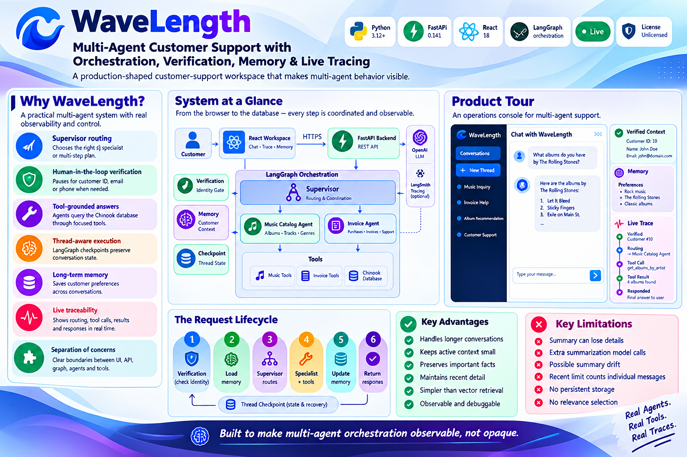
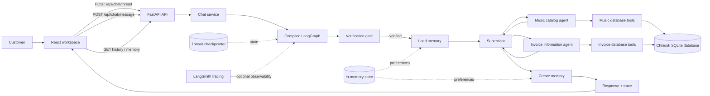
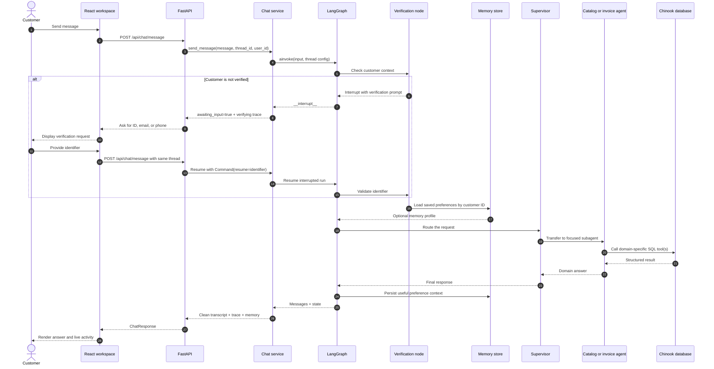
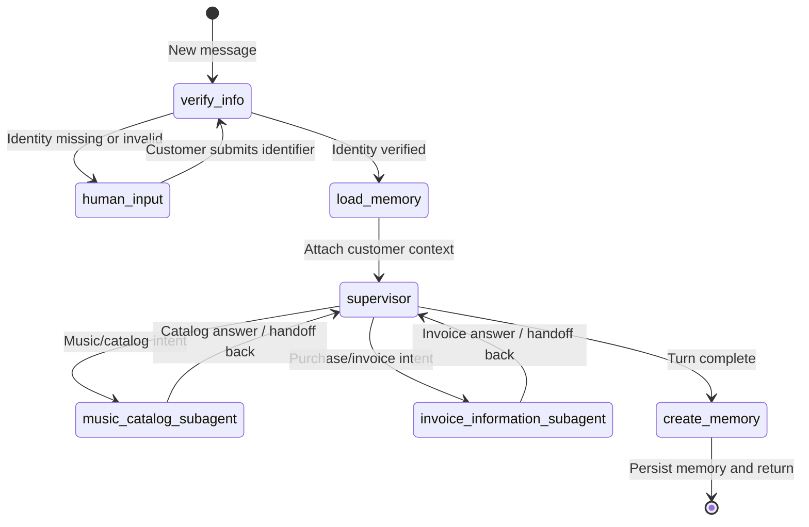
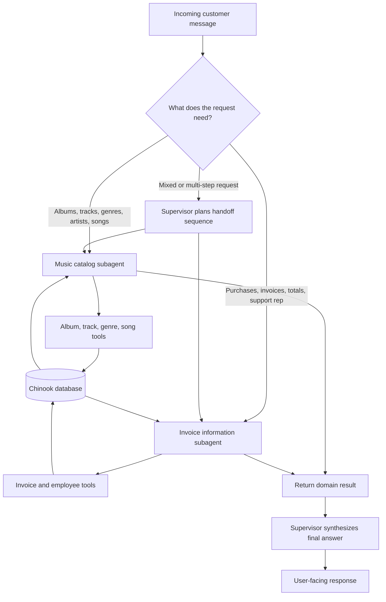
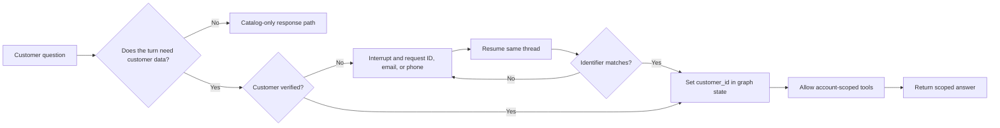
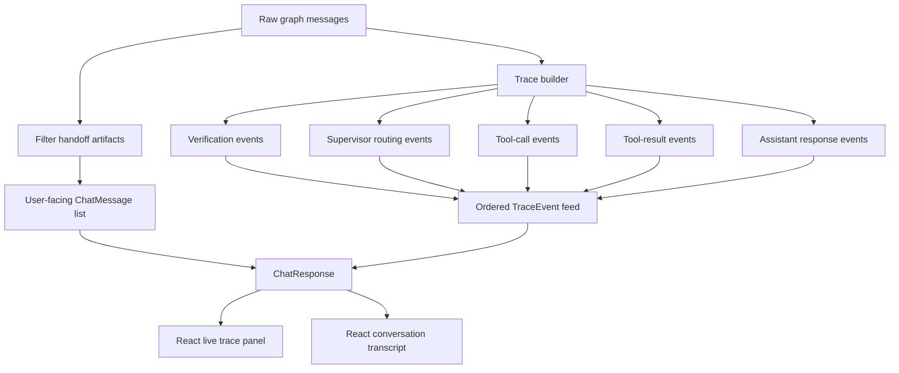
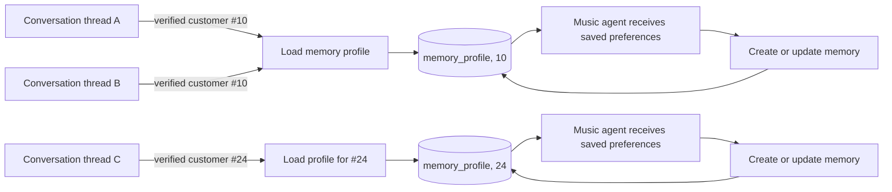
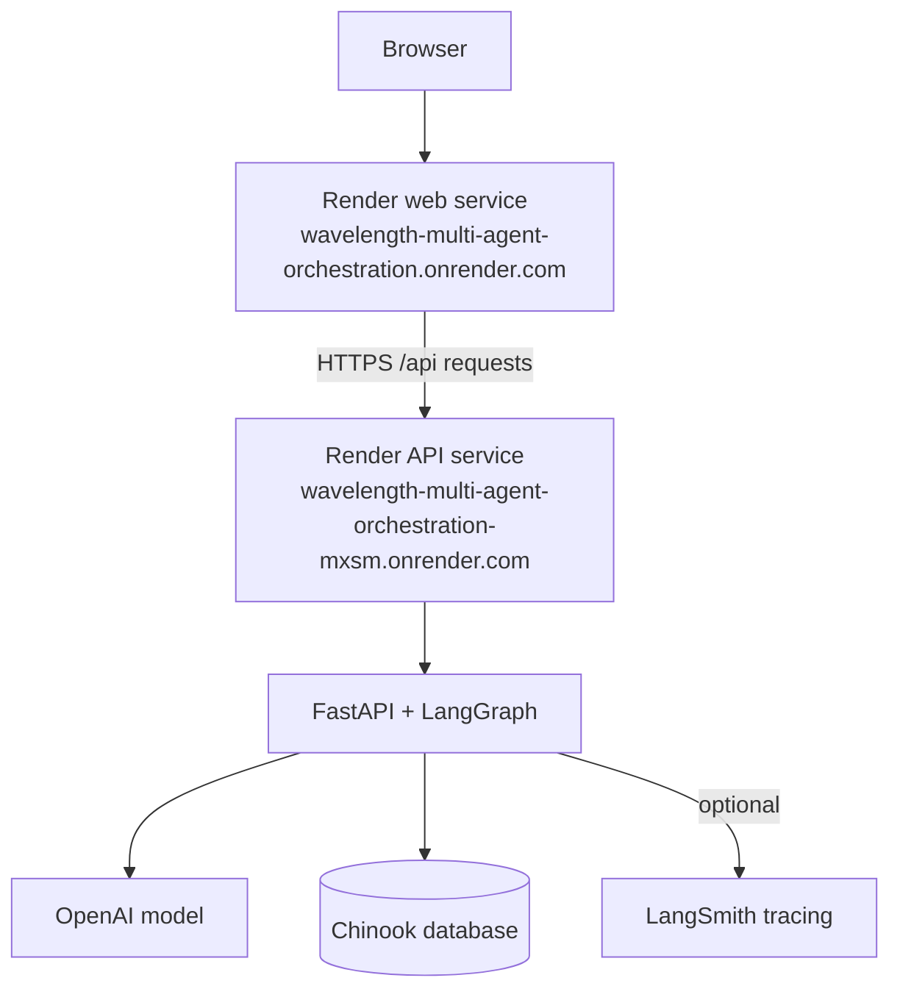

<div align="center">

# 🌊 WaveLength

### Multi-Agent Customer Support with Orchestration, Verification, Memory & Live Tracing


### 🚀 [**TRY THE LIVE DEMO →**](https://wavelength-multi-agent-orchestration.onrender.com/)

*Start with `What albums do you have by The Rolling Stones?` or `What was my most recent purchase? My customer ID is 10.`*





[](https://wavelength-multi-agent-orchestration.onrender.com/)
[](https://wavelength-multi-agent-orchestration-mxsm.onrender.com/docs)
[](https://github.com/paras160500/WaveLength-Multi-Agent-Orchestration-with-Tracing)

<br/>


</div>
<br/>
**A production-shaped customer-support workspace that makes multi-agent behavior *visible*.**

WaveLength pairs a React conversation workspace with a FastAPI + LangGraph backend — a supervisor that delegates to specialist agents, verified customer context, persistent thread checkpoints, and a live trace of every routing and tool step.

---

## 📑 Table of Contents

- [Why WaveLength?](#-why-wavelength)
- [Product Tour](#-product-tour)
- [System at a Glance](#-system-at-a-glance)
- [Request Lifecycle](#-request-lifecycle)
- [The Orchestration Graph](#-the-orchestration-graph)
- [Supervisor Routing Model](#-supervisor-routing-model)
- [Verification & Data Boundaries](#-verification--data-boundaries)
- [Trace Pipeline](#-trace-pipeline-from-graph-messages-to-ui-events)
- [Memory Lifecycle](#-memory-lifecycle)
- [Repository Map](#-repository-map)
- [API Surface](#-api-surface)
- [Run Locally](#-run-locally)
- [Deployment Topology](#-deployment-topology)
- [Design Decisions Worth Studying](#-design-decisions-worth-studying)
- [Example Conversations to Try](#-example-conversations-to-try)
- [Security & Production Hardening](#-security-and-production-hardening-notes)
- [Technology Stack](#-technology-stack)
- [Contributing](#-contributing)
- [License](#-license)
- [References](#-references)

---

## ✨ Why WaveLength?

Most multi-agent demos hide the interesting part: **what happened between the user message and the final answer.** WaveLength treats orchestration as a first-class product surface.

| Capability | What it demonstrates |
| --- | --- |
| 🧭 **Supervisor routing** | A planner chooses whether the request belongs to the music catalog agent, the invoice agent, or requires multiple specialist handoffs. |
| 🔐 **Human-in-the-loop verification** | Account-sensitive work pauses until the customer supplies an identifier such as a customer ID, email, or phone number. |
| 🛠️ **Tool-grounded answers** | Specialist agents query the Chinook music-store database through focused tools instead of inventing catalog or invoice data. |
| 🧵 **Thread-aware execution** | LangGraph checkpoints preserve conversation state and allow an interrupted run to resume on the same thread. |
| 🧠 **Long-term memory** | Customer preferences can be loaded before a turn and written back after a turn for use across conversations. |
| 📡 **Live traceability** | The interface exposes verification, routing, tool calls, tool results, and final responses as an ordered activity feed. |
| 🧩 **Separation of concerns** | React owns the workspace; FastAPI exposes the API; the graph owns orchestration; agents own domain behavior; tools own database access. |

---

## 🖥️ Product Tour

The deployed workspace is intentionally designed like an **operations console** rather than a bare chat box:

- 🗂️ **Conversation sidebar** — keeps multiple threads available and makes each thread independently addressable.
- 💬 **Central conversation view** — presents the cleaned, user-facing transcript without leaking supervisor handoff plumbing.
- 📊 **Live trace panel** — shows which agent acted, which tool was called, and how control moved through the graph.
- ✅ **Verified context card** — makes the account boundary visible to the operator.
- 🧠 **Memory card** — surfaces saved preference context when it exists.
- ⚡ **Suggested prompts** — provide fast paths for customer verification, catalog exploration, and invoice resolution.

---

## 🗺️ System at a Glance



The core design is a **verified, stateful routing loop**. The system does not send every question directly to every agent. It first establishes whether the request can proceed, loads useful context, delegates to the smallest relevant specialist, and returns both the answer and the trace of how that answer was produced.

---

## 🔁 Request Lifecycle

The following sequence shows what happens when a customer sends a message.



---

## 🧠 The Orchestration Graph

The graph is assembled in `app/graph/workflow.py`. It has one deliberate interrupt boundary: the graph can stop before account-scoped work and resume later without losing the thread.



### Why the graph is structured this way

1. **Verification comes first** so customer-scoped data is not exposed before the account boundary is established.
2. **Memory is loaded before routing** so the catalog agent can use saved music preferences when relevant.
3. **The supervisor delegates** instead of embedding every domain rule in one monolithic assistant.
4. **Specialists use tools** for database-backed answers and can perform multiple tool calls when necessary.
5. **Memory is written after the turn** so useful preference context can survive into a later conversation.
6. **The compiled graph is checkpointed** so a thread can pause and resume with the same state.

---

## 🧭 Supervisor Routing Model

The supervisor is the coordinator. It has access to two focused subagents and can sequence them when a request spans multiple domains.



| Subagent | Responsibility | Available tools |
| --- | --- | --- |
| `music_catalog_subagent` | Search the music catalog and use saved preferences for relevant context. | `get_album_by_artist`, `get_tracks_by_artist`, `get_songs_by_genre`, `check_for_song` |
| `invoice_information_subagent` | Retrieve and process customer purchase and invoice information. | `get_invoices_by_customer_sorted_by_date`, `get_invoices_sorted_by_unit_price`, `get_employee_by_invoice_and_customer` |
| `supervisor` | Decide the next specialist, coordinate handoffs, and produce the final response. | LangGraph supervisor handoff tools generated from the specialist set |

---

## 🔒 Verification & Data Boundaries

Verification is not a decorative UI state. It is a **graph-level gate**.



> 💡 The frontend reinforces this contract with the note **"Responses are scoped to verified customer data."** The API response also carries `awaiting_input`, `customer_id`, and a trace event so clients can represent the verification state explicitly.

---

## 📡 Trace Pipeline: From Graph Messages to UI Events

The backend deliberately separates the raw LangGraph transcript from the clean customer-facing transcript. `app/services/chat_service.py` builds both views from the new messages generated during the current turn.



The trace panel uses a compact event vocabulary:

| Trace action | Meaning in the workspace |
| --- | --- |
| `verifying` | The graph is waiting for a customer identifier. |
| `verified` | Identity context has been established. |
| `routing` | The supervisor or a specialist is transferring control. |
| `tool_call` | A domain tool is being invoked. |
| `tool_result` | A tool has returned data. |
| `responded` | An agent has produced a user-facing response. |

---

## 🧬 Memory Lifecycle

WaveLength separates **thread memory** from **customer memory**. Thread state is used to resume a particular conversation. Customer preference memory is keyed by customer identity and can be reused across conversations.



The debug endpoint is available for development inspection:

```
GET /api/debug/memory/{customer_id}
```

> ⚠️ It is intended for testing preference persistence and should **not** be treated as a production administration endpoint without additional access controls.

---

## 🗂️ Repository Map

```
.
├── app/
│   ├── agents/
│   │   ├── invoice_agent.py       # Invoice specialist built with a ReAct agent
│   │   ├── music_agent.py         # Music specialist with a tool loop
│   │   └── supervisor.py          # Supervisor prompt and specialist handoffs
│   ├── api/
│   │   └── routes.py              # FastAPI endpoints
│   ├── core/
│   │   ├── llm.py                 # Model, checkpoint, and store setup
│   │   └── state.py               # Shared graph state schema
│   ├── graph/
│   │   ├── memory.py              # Load and persist customer memory
│   │   ├── verification.py        # Human-in-the-loop identity gate
│   │   └── workflow.py            # Full compiled orchestration graph
│   ├── services/
│   │   └── chat_service.py        # Thread handling, traces, and responses
│   ├── tools/
│   │   ├── invoice_tools.py       # SQL tools for purchase data
│   │   └── music_tools.py         # SQL tools for catalog data
│   ├── config.py                  # Environment-backed settings
│   ├── database.py                # Chinook database initialization
│   ├── main.py                    # FastAPI application entrypoint
│   └── models/schemas.py          # Pydantic request and response models
├── frontend/
│   ├── src/
│   │   ├── api/client.js          # Browser-to-API calls
│   │   ├── components/            # Workspace, transcript, trace, and cards
│   │   ├── App.jsx                # Session and conversation orchestration
│   │   └── main.jsx               # React entrypoint
│   ├── package.json
│   └── vite.config.js
├── .env.example
├── requirements.txt
└── README.md
```

---

## 🔌 API Surface

The backend is mounted under `/api`.

| Method | Endpoint | Purpose |
| --- | --- | --- |
| `GET` | `/api/health` | Health check. |
| `POST` | `/api/chat/thread` | Create a new UUID-backed conversation thread. |
| `POST` | `/api/chat/message` | Start or resume a graph turn. |
| `GET` | `/api/chat/{thread_id}/history` | Retrieve the current thread state and user-facing history. |
| `GET` | `/api/debug/memory/{customer_id}` | Inspect saved customer memory during development. |
| `GET` | `/docs` | FastAPI's interactive API documentation on the deployed API service. |

<details>
<summary><strong>📬 Example: create a thread</strong></summary>

```bash
curl -X POST \
  https://wavelength-multi-agent-orchestration-mxsm.onrender.com/api/chat/thread
```

Example response:

```json
{
  "thread_id": "8a0f8a0e-7e1a-47d6-9f18-0f1b0de1c1a1"
}
```

</details>

<details>
<summary><strong>💬 Example: send a message</strong></summary>

```bash
curl -X POST \
  https://wavelength-multi-agent-orchestration-mxsm.onrender.com/api/chat/message \
  -H "Content-Type: application/json" \
  -d '{
    "message": "What albums do you have by The Rolling Stones?",
    "thread_id": "8a0f8a0e-7e1a-47d6-9f18-0f1b0de1c1a1",
    "user_id": null
  }'
```

A response contains the new user-facing messages, verification status, customer ID when known, trace events, and memory profile when available.

</details>

---

## 🏃 Run Locally

### Prerequisites

- Python **3.12 or newer**
- Node.js and npm
- An OpenAI-compatible API key
- Optional: a LangSmith API key for external tracing

### 1️⃣ Clone the repository

```bash
git clone https://github.com/paras160500/WaveLength-Multi-Agent-Orchestration-with-Tracing.git
cd WaveLength-Multi-Agent-Orchestration-with-Tracing
```

### 2️⃣ Configure the backend

```bash
python -m venv .venv
source .venv/bin/activate
pip install -r requirements.txt
cp .env.example .env
```

Set at least the model provider credentials in `.env`:

```
OPENAI_API_KEY=your_api_key_here
OPENAI_MODEL=gpt-4o-mini
```

Optional LangSmith configuration:

```
LANGSMITH_API_KEY=your_langsmith_key_here
LANGSMITH_TRACING=true
LANGSMITH_PROJECT=multi-agent-ai-system
```

> The default database source is the public Chinook SQLite SQL dump configured by `CHINOOK_SQL_URL`. Override it only when you have a compatible database source.

### 3️⃣ Start the FastAPI backend

```bash
uvicorn app.main:app --reload --port 8000
```

Verify that it is running:

```bash
curl http://localhost:8000/api/health
```

### 4️⃣ Start the React frontend

Open a second terminal:

```bash
cd frontend
npm install
npm run dev
```

Open **[http://localhost:5173](http://localhost:5173)**. Vite proxies `/api` requests to `http://localhost:8000` during local development.

### 5️⃣ Build the frontend for production

```bash
cd frontend
npm run build
npm run preview
```

---

## ☁️ Deployment Topology

The current deployment uses two Render services. The public frontend is the URL users open. The frontend API client points to the separate backend service.



For a Render deployment, the backend start command is:

```bash
uvicorn app.main:app --host 0.0.0.0 --port $PORT
```

The frontend build uses the existing Vite configuration. Ensure the deployed frontend continues to target the intended API service and that the backend CORS allowlist contains the frontend origin.

### ✅ Deployment checklist

| Check | Expected result |
| --- | --- |
| Backend binds to `0.0.0.0` | Render can route traffic to the service. |
| Backend uses `$PORT` | The service follows Render's assigned port. |
| `OPENAI_API_KEY` is configured | Agent calls can execute. |
| `CHINOOK_SQL_URL` is reachable | The sample database can initialize. |
| Frontend API base URL is correct | Browser requests reach the deployed backend. |
| Frontend origin is allowed by CORS | Browser calls are not blocked. |
| `/api/health` returns successfully | Basic service health is confirmed. |

---

## 🎓 Design Decisions Worth Studying

### 1. The graph, not the UI, owns workflow state

The React app stores display state such as active sessions and trace history. The graph owns verification, routing, tool execution, and memory transitions. This keeps the policy boundary on the server and makes the workflow reusable by clients other than the current React UI.

### 2. Handoff plumbing is hidden from the customer transcript

Supervisor frameworks produce internal transfer messages. The service layer filters those artifacts before building `ChatMessage` objects, while still translating the same activity into trace events. The customer receives a clean answer; the operator can still inspect the route.

### 3. The API returns incremental turn data

The service tracks how many messages from a thread have already been returned. Each response carries only the new user-facing messages and new trace events for that turn, which keeps the frontend update small and makes the trace panel easy to append.

### 4. Verification is resumable

When the graph interrupts, the service records that the thread is waiting for input. The next message is interpreted as a `Command(resume=...)` for the same graph execution rather than as an unrelated new turn.

---

## 💡 Example Conversations to Try

| Prompt | What to observe |
| --- | --- |
| `What albums do you have by The Rolling Stones?` | Supervisor routing to the catalog agent and catalog tool activity. |
| `Find songs in the Rock genre.` | Genre lookup and formatted song results. |
| `Does the song Come Together exist?` | Exact or partial song search behavior. |
| `What was my most recent purchase? My customer ID is 10.` | Invoice routing and customer-scoped database access. |
| `Show my invoices sorted by unit price. My customer ID is 10.` | Invoice-line lookup and ordering. |
| `Verify me with aaron.mitchell@chinookcorp.com` | Human-in-the-loop verification and the verified-context card. |

---

## 🛡️ Security and Production Hardening Notes

> This project is an **educational and demonstrative system**, not a finished customer-support security boundary. Before using real customer data, harden the following areas:

- 🔑 Replace the sample identifier verification flow with an authenticated identity provider and server-side authorization checks.
- 🧷 Parameterize every SQL query. The current tools interpolate user-derived values and should not be exposed to untrusted production input in their current form.
- 🚫 Protect or remove `/api/debug/memory/{customer_id}` in production.
- 🗄️ Move thread bookkeeping and memory storage out of process memory when running multiple replicas.
- 📈 Add rate limiting, structured audit logs, secret rotation, and request-level authorization.
- 🌐 Restrict CORS to the exact production origins required by the deployment.
- 🧪 Add automated tests for verification failures, cross-customer access attempts, tool errors, and interrupted-run recovery.

These notes are part of the value of the demo: an observable architecture makes it easier to see where production controls must be added.

---

## 🧰 Technology Stack

| Layer | Technology |
| --- | --- |
| Frontend | React 18, Vite, Tailwind CSS |
| API | FastAPI, Pydantic |
| Orchestration | LangGraph, LangGraph Supervisor |
| Agents | LangChain tools, ReAct-style invoice agent, tool-loop music agent |
| Model provider | OpenAI-compatible chat model; default `gpt-4o-mini` |
| Database | Chinook sample music-store database through SQLAlchemy / LangChain SQL tooling |
| Observability | Built-in trace feed, optional LangSmith tracing |
| Deployment | Render frontend and API services |

---

## 🤝 Contributing

Contributions are welcome when they improve correctness, observability, or the clarity of the agent boundary. A useful contribution should explain the behavior it changes, include a focused test or reproducible example where practical, and avoid committing secrets or generated build output.

```bash
git checkout -b feature/your-improvement
# make and verify your changes
git add .
git commit -m "Describe the improvement"
git push origin feature/your-improvement
```

---

## 📄 License

No license file is currently included in the repository. Add an explicit license before redistributing the project or accepting external contributions under a defined license.

---

## 📚 References

1. [WaveLength source repository](https://github.com/paras160500/WaveLength-Multi-Agent-Orchestration-with-Tracing)
2. [WaveLength deployed frontend](https://wavelength-multi-agent-orchestration.onrender.com/)
3. [WaveLength deployed FastAPI documentation](https://wavelength-multi-agent-orchestration-mxsm.onrender.com/docs)
4. [Chinook sample database](https://github.com/lerocha/chinook-database)
5. [LangGraph documentation](https://langchain-ai.github.io/langgraph/)
6. [FastAPI documentation](https://fastapi.tiangolo.com/)
7. [React documentation](https://react.dev/)

<div align="center">

---

**Built to make multi-agent orchestration observable, not opaque.**

[🚀 Live Demo](https://wavelength-multi-agent-orchestration.onrender.com/) · [📘 API Docs](https://wavelength-multi-agent-orchestration-mxsm.onrender.com/docs) · [💻 Source](https://github.com/paras160500/WaveLength-Multi-Agent-Orchestration-with-Tracing)

</div>
